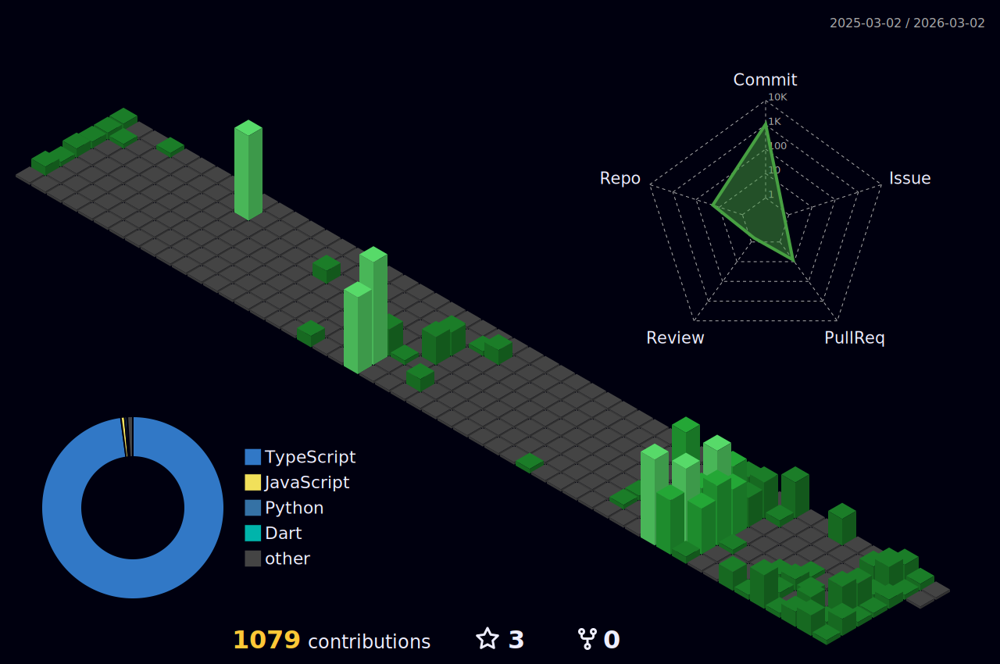

 

<!-- Typing SVG by DenverCoder1 - https://github.com/DenverCoder1/readme-typing-svg -->

 
 
  <!--Crédit https://www.deviantart.com/dokitsu/art/Kuro-s-the-black-wizard-Mazgeon-605238839-->
  

<h1 align="center">Hi There! &nbsp;&nbsp;&nbsp;I'm Shivansh Goel</h1>

<h3 align="center">

</h3>

<h3 align="center"><strong> A Passionate Developer from India 🇮🇳 </strong> </h3>

  

  

- 🔭 I’m currently to collaborate on **open-source projects**

- 🌱 I’m currently learning **Advanced Full Stack Technologies**

- 💬 Ask me about **JavaScript, Python, React, Next.js, Cloud**

- 📫 Reach me at **shivansh..goela12@gmail.com**

- 📍 Location: **Muzaffarnagar, Uttar Pradesh, India**

- 📄 Download my [Resume](https://drive.usercontent.google.com/u/0/uc?id=1MGXNj2utvuwFnYIyHX6PgIfJMHUeGdce&export=download)

- ⚡ Fun fact **I am a Tech Aficionado 🚀**

  

  

<h2 align='center'><strong>Socials and Coding Profiles 💻</strong></h2>

   

  

<h2 align='center'><strong>Languages, Tools and Technologies 🚀 </strong></h2>
	 
<table>
	<tr>
		<td><strong>Programming Languages</strong></td>
		<td></td>
	</tr>
	<tr>
		<td><strong>Frontend Development</strong></td>
		<td></td>
	</tr>
	<tr>
		<td><strong>Backend Development</strong></td>
		<td></td>
	</tr>
	<tr>
		<td><strong>Database Technologies</strong></td>
		<td></td>
	</tr>
	<tr>
		<td><strong>Cloud & DevOps</strong></td>
		<td></td>
	</tr>
	<tr>
		<td><strong>Tools & Platforms</strong></td>
		<td></td>
	</tr>
    <tr>
		<td><strong>Libraries & Others</strong></td>
		<td></td>
	</tr>
</table>

  

 
 

<h3 align='center'><strong>Github Analytics ⚙️</strong></h3>

 

<markdown-accessiblity-table data-catalyst="">
  <table style="width: 100%; background-color: #1e1e1e; color: white; table-layout: fixed;">
    <thead>
	    <tr>
		  <th colspan="2" align="center">
			   
		  </th>
		</tr>
      <tr>
        <th style="padding: 20px; text-align: center;">
          
        </th>
        <th style="padding: 20px; text-align: center;">
          
        </th>
      </tr>
    </thead>
	   <tr>
        <td  colspan="2" align="center"> 
		 
	
		
<picture>
  		<source media="(prefers-color-scheme: dark)" srcset="https://raw.githubusercontent.com/Tech-aficionado/Tech-aficionado/output/github-contribution-grid-snake-dark.svg" />
  <source media="(prefers-color-scheme: light)" srcset="https://raw.githubusercontent.com/Tech-aficionado/Tech-aficionado/output/github-contribution-grid-snake.svg" />
  
</picture>
	</td>
	</tr>
  </table>
  
</markdown-accessiblity-table>

