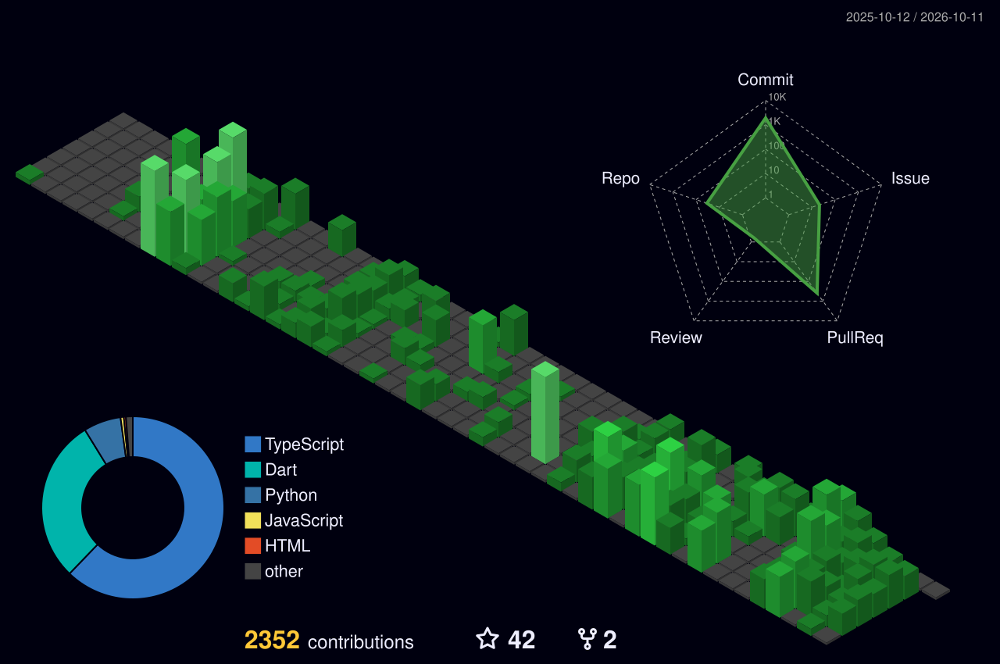

Final-year B.Tech CSE student from India 🇮🇳 who builds and <b>ships</b> production apps end to end — 
Flutter mobile apps on real testers' phones, Next.js web platforms, Python backends, and AI features that actually hold up.

---

### 🧑‍💻 About me

- 🚀 I like taking an idea all the way to **users' hands** — auth, payments, CI/CD, releases, monitoring, the boring-but-important parts included.
- 📱 Mostly working in **Flutter**, **Next.js / TypeScript**, **Python (FastAPI)**, **Supabase** and **Firebase**.
- 🤖 Building AI features with LLM APIs (Groq, Gemini) behind secure server-side gateways — never keys in the client.
- 🌱 Currently exploring security tooling, offline-first architecture, and local on-device AI models.
- 🤝 Open to **full-time roles and internships** — the fastest way to reach me is [email](mailto:shivansh.goela12@gmail.com).
- 📍 Muzaffarnagar, Uttar Pradesh, India

---

### 🛠️ Products I've built

| Project | What it is | Stack |
| --- | --- | --- |
| 🏋️ **[FitTrack AI](https://fittrack.0xshiv.dev/)** | AI fitness coach — workout & nutrition plans, barcode food lookup, step tracking, 3D exercise library. Shipped to testers through CI-driven Android releases. | Flutter · Firebase · Supabase Edge · Next.js |
| 🧠 **[Quizify](https://quizify.0xshiv.dev)** | AI quiz platform — generated quizzes, Quiz Arena, leaderboards, daily quests, XP & streaks. | Flutter · Supabase · AI orchestrator |
| 🏫 **[CampusPass](https://0xshiv.dev/#contact)** | Multi-tenant hostel leave & outpass system — offline-verifiable signed passes, guard gate scanner, tamper-evident audit trail. Demo on request | TypeScript · Node · Postgres · Redis · Docker |
| 🛡️ **[Aegis-X](https://0xshiv.dev/#contact)** | Security intelligence dashboard — repo scanning, AI code review, and an architecture map for any GitHub repo. Demo on request | Next.js · FastAPI · Docker |
| 🛒 **[VyaaparAI](https://vyaaparai.in)** | AI-powered storefront builder for small Indian businesses with per-store custom domains. | Next.js · Python · Vercel |

Most of these are private repos — happy to walk through the code in an interview.

### 🌍 Open source

- 🧱 **[CraftFolio](https://github.com/Tech-aficionado/CraftFolio---Open-Sourced-Minecraft-Portfolio-Library)** — npm library: turn a React app into a Minecraft-themed portfolio with a live 3D voxel world, in one component.
- 👻 **[GhostRelay](https://github.com/Tech-aficionado/GhostRelay---Open-Source)** — privacy-first email aliasing on the Cloudflare free stack. [Live ↗](https://ghostrelay.me)
- 🔗 **[ZipLink](https://github.com/Tech-aficionado/ZipLink---Open-Source)** — fast, self-hostable URL shortener (Next.js + Firebase). [Live ↗](https://ziplink.0xshiv.dev)
- 🌳 **[Forkcast](https://github.com/Tech-aficionado/Forkcast---Open-Source-Git)** — branch life decisions like a git repo, commit predictions, and let time score your judgment.
- 🤝 **[DareStake](https://github.com/Tech-aficionado/darestake)** — two-person accountability PWA with a race-safe penalty engine and 86 tests. [Live ↗](https://darestake.0xshiv.dev)
- 📻 **[MoodRadio](https://github.com/Tech-aficionado/MoodRadio)** — type how you feel, AI plays matching music. [Live ↗](https://moodradio.0xshiv.dev)
- 🐣 **[Tamagochi](https://github.com/Tech-aficionado/Tamagochi---Open-Source-Game)** — an adorable open-source virtual pet game. [Live ↗](https://tamagochi-open-source-game.vercel.app/)
- 📈 **[MarginMind Pro](https://github.com/Tech-aficionado/MarginMind-Pro)** — resilient async trading terminal for Binance Futures.

---

### ⚙️ Tech I use

| | |
| --- | --- |
| **Languages** |  |
| **Frontend & Mobile** |  |
| **Backend** |  |
| **Data** |  |
| **Cloud & DevOps** |  |
| **Tools** |  |

---

<h3 align="center">📊 GitHub activity</h3>
 

<picture>
  <source media="(prefers-color-scheme: dark)" srcset="https://raw.githubusercontent.com/Tech-aficionado/Tech-aficionado/output/github-contribution-grid-snake-dark.svg" />
  <source media="(prefers-color-scheme: light)" srcset="https://raw.githubusercontent.com/Tech-aficionado/Tech-aficionado/output/github-contribution-grid-snake.svg" />
  
</picture>

<!-- Skyline: contribution graph rendered as an animated ASCII city (generated by the skyline workflow) -->

